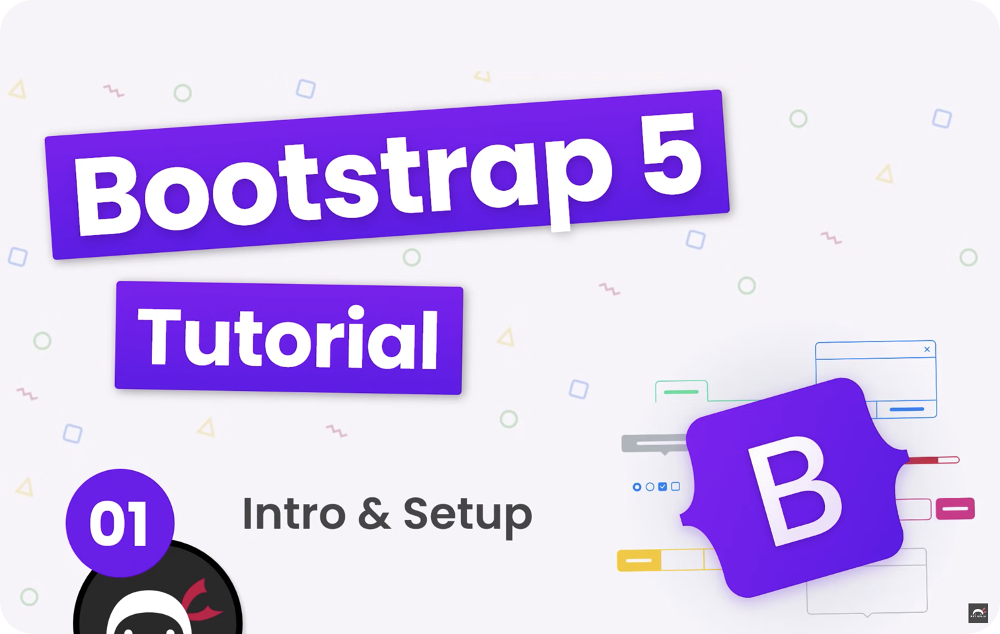

# Bootstrap 5 Course

## Description

Welcome to the Bootstrap 5 Course! This comprehensive course consists of 20 videos covering the implementation of various Bootstrap 5 components. Led by @NetNinja, this course is designed to guide you through the essential features and functionalities of Bootstrap 5, a popular front-end framework.

Throughout the course, you'll explore the implementation of key components that enhance the responsiveness and visual appeal of your web projects. From navigation bars to modals, carousels to forms, Bootstrap 5 Course provides hands-on experience in utilizing the full spectrum of Bootstrap components.

Whether you're a beginner seeking to understand the basics of Bootstrap or an experienced developer looking to expand your knowledge of the latest version, this course serves as a valuable resource. Follow along with the videos to master the art of building modern, responsive web applications with Bootstrap 5.

## Live Demo

Explore the Bootstrap 5 Course by visiting the live demo [Live Demo](https://codenaud.github.io/bootstrap-basic-tutorial/)

## Features

- **Comprehensive Component Coverage:** The course covers a wide range of Bootstrap 5 components, ensuring a thorough understanding of its capabilities.

- **Hands-On Learning:** Each video provides practical examples and demonstrations, allowing you to follow along and implement Bootstrap components in real-time.

- **Responsive Design:** Bootstrap 5's responsive design features are emphasized, ensuring your projects look great on various devices.

- **Interactive Content:** Learn how to create interactive and engaging web content using Bootstrap 5's interactive components.

- **Instructor-Led:** Led by @NetNinja, an experienced instructor, the course provides clear explanations and guidance to help you grasp Bootstrap concepts effectively.

## Technologies Used

The Bootstrap 5 Course project utilizes the following technologies:

- HTML5: Provides the structure and organization of the web content.
- CSS3: Applies styles and visual enhancements to the Bootstrap components.
- Bootstrap 5: The core front-end framework used for building responsive and interactive web pages.
- Code Editor: A code editor is used for writing and editing the source code presented in the course.

## Badges/Shields

Dev Skills

Build with

## Acknowledgments

This project would not have been possible without the incredible community of developers and designers who continually inspire and support each other.

Special thanks to @NetNinja for creating and delivering this Bootstrap 5 Course. You can find the course and more at [NetNinja's YouTube Channel](https://www.youtube.com/c/thenetninja).

---

    - Net ninja
    - Youtube Channel: [URL](https://www.youtube.com/@NetNinja)
    - First video of the series: [URL](https://youtu.be/O_9u1P5YjVc?si=vE1mIloZFoNhucQh)

    --> @NetNinja

---

## About Me

I'm a junior frontend developer passionate about HTML, CSS and JavaScript, who wants to share the work of all the people who have helped me on the way to being able to dedicate myself to what I like the most.

## Contact

If you have any questions or suggestions, do not hesitate to contact me through my email: [codenaud@gmail.com](mailto:codenaud@gmail.com)

Happy coding! 🚀
